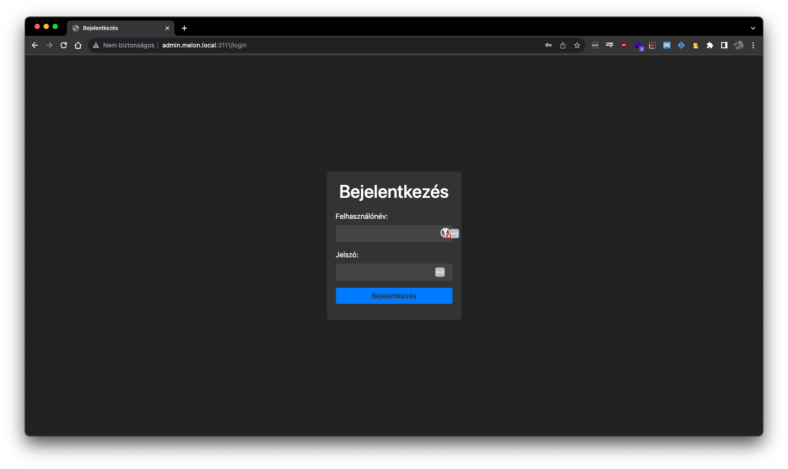
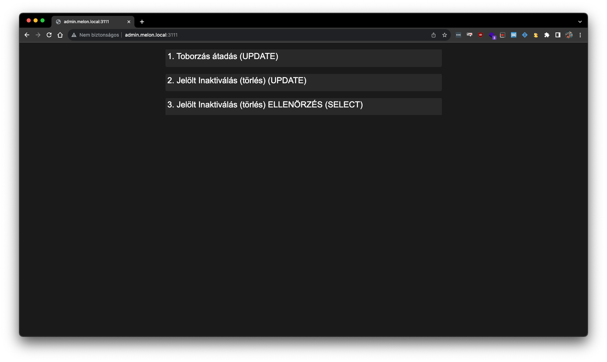
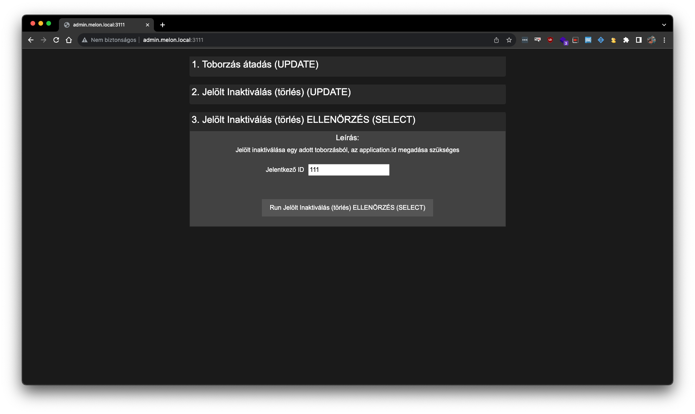
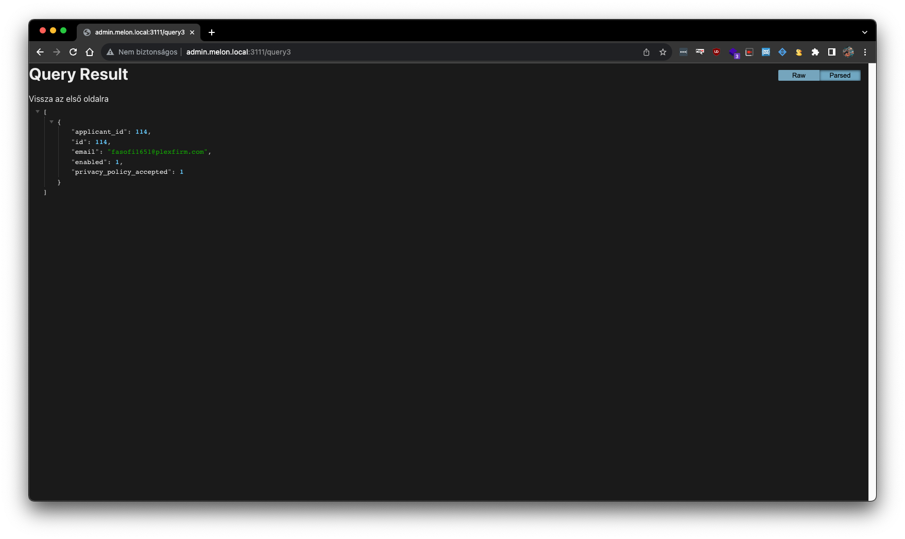

# Database Administration Web Application

This web application provides an intuitive interface for database administration tasks. It allows users to manage SQL queries dynamically, making it easy to add, edit, and execute queries on the database. The application also incorporates user management features, enhancing security and access control.

# Docker image

Docker image pull: `docker pull webery/mysql-query-gui:0.1`
DockerHub: `https://hub.docker.com/repository/docker/webery/mysql-query-gui/`

## Setup

1. Clone the repository to your local machine.
2. Rename the following .dist files without the .dist extension:
    * `.env.dist` => `.env`
    * `elements.js.dist` => `elements.js`
    * `query_log.txt.dist` => `query_log.txt`
    * `users.json.dist` => `users.json`
    3\. Edit the `users.json` file to add user accounts. To generate password hashes, run the password generation script using `node password-generate/password-generate.js`. The generated password and its bcrypt hash should be added to the `users.json` file.
3. Edit the `elements.js` file to add SQL queries, descriptions, and labels. Use `$v1`, `$v2`, and so on to indicate variables in the query, and the corresponding input fields will be created for each variable with the specified labels in the application.
4. Ensure you have Docker and Docker Compose installed on your system.

## Running the Application

1. Build the Docker image and start the application using Docker Compose:
```docker-compose up -d```
2. The application will be available at `http://localhost:3111`.
3. Login screen.

4. After login





## Usage

1. On the homepage, you will find a list of available queries organized in accordion-style elements.
2. Click on the accordion headers to expand or collapse the query description and input fields.
3. Fill in the required input fields for the query, as indicated by the labels provided in `elements.js`.
4. Click the "Run" button to execute the query. A confirmation popup will appear before execution.
5. The application will perform the database operation based on the query and display the result.

## Docker Configuration

The application includes a Dockerfile and a docker-compose.yml file.

* The Docker container listens on port 3111.
* To build the Docker image and start the application, use the command `docker-compose up -d`.
* After making changes to `users.json` or `elements.js`, restart the Docker container using `docker-compose restart`.

## Acknowledgment

The development of this application was greatly assisted by OpenAI's ChatGPT, an AI language model, which provided solutions and insights during the creation process.

## Contributing

Contributions to this project are welcome. To contribute, please follow these steps:

1. Fork the repository on GitHub.
2. Create a new branch with a descriptive name (`git checkout -b feature/your-feature-name`).
3. Make your changes and commit them (`git commit -m "Add your commit message"`).
4. Push your changes to your forked repository (`git push origin feature/your-feature-name`).
5. Create a pull request on the main repository to merge your changes.

## License

This project is licensed under the MIT License. See the LICENSE file for more details.

## Contact

If you have any questions or feedback, feel free to contact the project maintainer via email at [hello@geri.app](mailto:hello@geri.app).

Enjoy using the Database Administration Web Application!